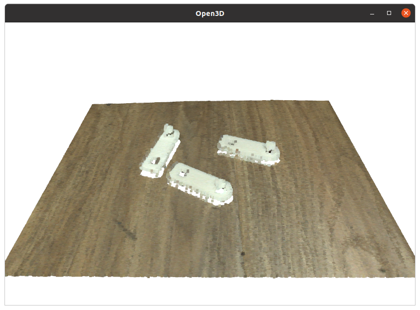

# rvc-simple
如本RVC工业深度摄像头 Python SDK 简化版 





## 快速上手

```python
'''
如本工业深度摄像头 Open3D示例 
- 获取PCD点云并可视化
@作者: 阿凯爱玩机器人
@微信: xingshunkai
@邮箱: xingshunkai@qq.com
@B站: https://space.bilibili.com/40344504
'''
import open3d as o3d
from rvc_simple import RVCSimple

# 创建设备
rvc = RVCSimple()
# 获取图像与点云
img, pmap, pcd = rvc.capture()
# Open3D点云可视化
o3d.visualization.draw_geometries([pcd])
# 释放设备
rvc.release()
```

