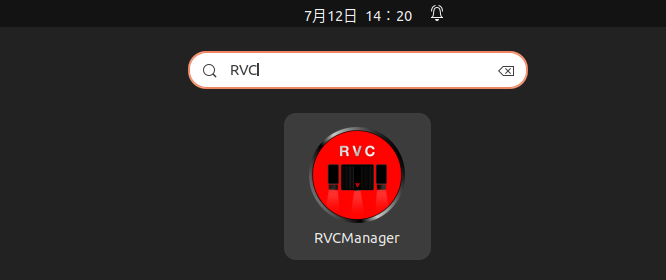
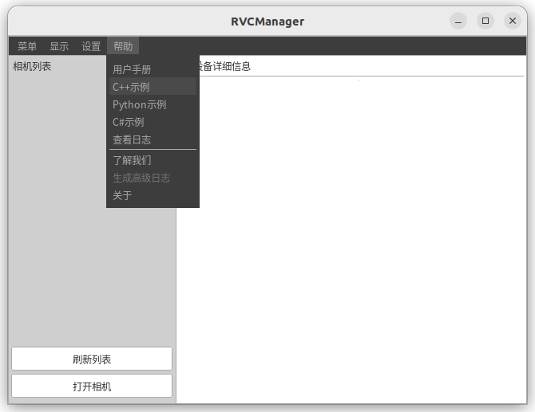
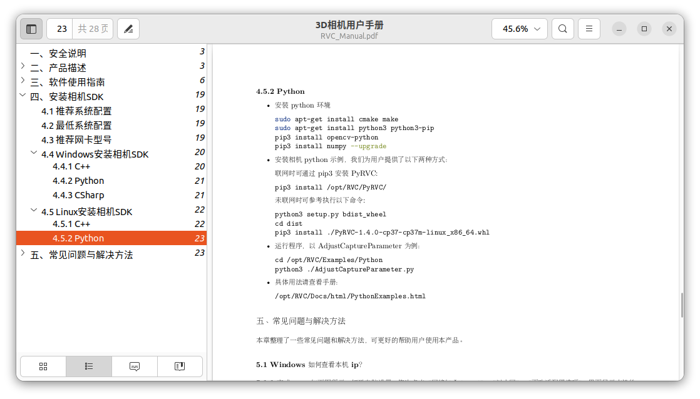

# RVC系列工业深度摄像头 Python SDK


## 准备工作

使用前确保已经安装了Open3D与如本RVC 3D相机Python SDK。 

### Open3D

Windows下安装Open3D

```bash
pip install open3d
```

Ubuntu下安装Open3D

```bash
sudo pip3 install open3d 
```


### 如本3D相机Python SDK

如本3D相机的Python SDK安装包是内置到上位机软件里面的。

在[如本-下载中心](http://www.rvbust.com/download.html) 下载最新版本的SDK， 根据自己的平台进行选择。 如果PC配有显卡，也可以选择`cuda`版本, 但是前提是需要安装显卡驱动以及CUDA。

* [RVC SDK 1.5.1 (Linux)](http://www.rvbust.com/Downloads/RVC_v1.5.1-deb-9f40ac1_20220429_amd64_release.deb)
* [RVC SDK 1.5.1 (Windows)](http://www.rvbust.com/Downloads/RVCSetup_v1.5.1_9f40ac1_20220429_x64_release.exe)

安装后， 在启动栏可以搜索`RVCManager`。



启动上位机软件, 点击`帮助 -> 用户手册` 



可以查看用户手册， 里面包含相机的使用以及Python SDK安装说明。提供了Windows跟Linux两个操作系统的安装说明。



按照手册说明安装SDK即可。


## 快速上手

**文件结构**

* `src/rvc_simple.py` 

  定义了RVC 3D相机Python-Open3D的SDK， 是在如本提供的Python SDK基础上做了二次封装。 

* `src/test_pcd_capture.py.py`

  是`rvc_simple.py`的使用实例，功能如下:

  * 拍摄RGB图与XYZ格式的点云， 并保存
  * 将RGB图与XYZ点云转换为PCD格式的点云
  * 彩色点云可视化预览
  
* `src/pcd_visualizer.py` 

  点云动态刷新可视化组件

* `src/test_pcd_visualizer.py`

  测试RVC 3D相机点云获取与动态刷新


测试点云获取

```bash
python3 test_pcd_capture.py.py
```

测试点云获取与动态刷新

```bash
python3 test_pcd_visualizer.py
```


可以先大致看下示例代码， 在后面的课程章节中会对Open3D的API做详细的讲解。

`test_pcd_capture.py`

```python
'''
如本工业深度摄像头Open3D示例
- 读取图像与点云映射， 并转换为open3d的pcd格式
@作者: 阿凯爱玩机器人
@微信: xingshunkai
@邮箱: xingshunkai@qq.com
@B站: https://space.bilibili.com/40344504
'''
import numpy as np
import cv2
import open3d as o3d
from rvc_simple import RVCSimple

# 相机的配置文件 YAML格式
# 根据不同的工件特性，设置不同的参数
# 默认配置为RVC-X Mini彩色相机的配置文件
config_path = "config/default.yaml"
# 创建设备
rvc = RVCSimple(config_path=config_path)
# 获取图像与点云映射
img, pmap = rvc.capture()
# 获取PCD点云
pcd = rvc.get_pcd(img, pmap)

# 保存2D图像
cv2.imwrite("./data/test.png", img)
# 保存点云映射 单位m
np.savetxt("./data/test.xyz", pmap.reshape(-1, 3), delimiter=",", fmt="%.4f")
# 保存PCD点云
o3d.io.write_point_cloud("./data/test.pcd", pcd)

# Open3D点云可视化
o3d.visualization.draw_geometries([pcd])

# 释放设备
rvc.release()
```


## 修改配置文件

使用上位机软件RVCManager调整相机参数，并保存到YAML配置文件中。

在`config`文件夹下存放相机的配置文件:

`default.yaml`

```yaml
# 默认RVC X Mini 3D相机参数
# 相机类型：
#  - 彩色相机: "rgb"
#  - 黑白相机: "gray"
type: "rgb"
# 曝光时间 (3~100) ms
exposure_time_2d: 100
exposure_time_3d: 20
# 增益
gain_2d: 4.0
gain_3d: 0.0
# Gamma
gamma_2d: 0.312
gamma_3d: 1.0
# 边缘去噪阈值, 取值范围 [0, 10]
edge_noise_reduction_threshold: 0
# 投影颜色
# 建议选择白色光投影
# 可选颜色: ["red", "green", "blue", "white"]
projector_color: "blue"
# 光强对比度阈值
light_contrast_threshold: 2
```


## 作者

| 作者               | 阿凯爱玩机器人                                               |
| ------------------ | ------------------------------------------------------------ |
| 微信               | xingshunkai                                                  |
| QQ                 | 244561792                                                    |
| B站                | [阿凯爱玩机器人](https://space.bilibili.com/40344504)        |
| 淘宝店铺           | [阿凯爱玩机器人](https://shop140985627.taobao.com/)          |
| RVC X Mini购买链接 | [双目+结构光深度摄像头3d立体工业智能相机三维点云处理机器视觉](https://item.taobao.com/item.htm?spm=a1z10.1-c-s.w4001-24215588138.3.50ff67c8EuazCJ&id=665921104824&scene=taobao_shop) |
